# System Design: ระบบจองวันตรวจสุขภาพประจำปีสำหรับเจ้าหน้าที่โรงพยาบาล (Hospital Staff Annual Health Checkup Booking System)

## 1. Project Overview (ภาพรวมโครงการ)

ระบบจองวันตรวจสุขภาพประจำปีสำหรับเจ้าหน้าที่โรงพยาบาล ออกแบบเพื่ออำนวยความสะดวกให้เจ้าหน้าที่สามารถเลือกจองวันเข้ารับการตรวจสุขภาพได้ด้วยตนเองอย่างมีประสิทธิภาพ รองรับการจำกัดจำนวนผู้เข้ารับบริการในแต่ละวัน (Quota Limit เช่น วันละ 45 คน) รวมถึงให้ผู้ดูแลระบบ (Admin / ฝ่ายทรัพยากรบุคคล / ฝ่ายอาชีวเวชกรรม) สามารถบริหารจัดการช่วงเวลาเปิดรับจอง โควต้ารายวัน และวันหยุดทำการได้อย่างยืดหยุ่น

---

## 2. Tech Stack Architecture

| Layer | Technology Selected | Description & Rationale |
| :--- | :--- | :--- |
| **Framework** | Next.js 14/15 (App Router) + TypeScript | React Framework ประสิทธิภาพสูง รองรับ Server Components, Server Actions และ SEO |
| **Styling & UI** | Tailwind CSS + shadcn/ui + Lucide Icons | Design System สไตล์ Modern, Responsive, Accessible และ Clean Aesthetic |
| **Database** | MySQL 8.0+ | Relational Database รองรับ ACID Transactions, Row Locks สำหรับ Concurrency Control |
| **ORM** | Drizzle ORM (MySQL driver: mysql2) | TypeScript-first ORM ประสิทธิภาพสูง Type-safe และควบคุม SQL Queries ได้แม่นยำ |
| **Authentication** | NextAuth.js / Auth.js | รองรับการเชื่อมต่อกับระบบโรงพยาบาลเดิม (HOSxP, Active Directory, SSO) |
| **Notification** | LINE Messaging API / LINE Notify | แจ้งเตือนยืนยันการจอง และเตือนล่วงหน้า 1 วันก่อนถึงวันตรวจสุขภาพ |

---

## 3. User Roles & Permissions

1. **Staff (เจ้าหน้าที่โรงพยาบาล):**
   - เข้าสู่ระบบด้วยรหัสพนักงาน (Employee Code / SSO)
   - ดูปฏิทินวันตรวจสุขภาพที่เปิดรับจองพร้อมจำนวนโควต้าคงเหลือ Real-time
   - ทำการจองวันตรวจสุขภาพ (จำกัดสิทธิ์ 1 คนต่อ 1 คิวต่อรอบแคมเปญ)
   - เลื่อน/เปลี่ยนแปลงวัน หรือยกเลิกการจองตามเงื่อนไขเวลาที่กำหนด
   - รับการแจ้งเตือนยืนยันผ่านระบบ / LINE Notification

2. **Admin (ผู้ดูแลระบบ / ฝ่าย HR / ฝ่ายอาชีวเวชกรรม):**
   - สร้างและเปิด/ปิดรอบแคมเปญการตรวจสุขภาพ (Checkup Campaigns)
   - กำหนดช่วงวันตรวจสุขภาพ และตั้งค่าโควต้าตั้งต้น (Default Daily Quota)
   - ปรับเพิ่ม/ลดโควต้ารายวันเฉพาะกิจ (Custom Quota)
   - ตั้งค่าปิดรับจองในวันหยุดนักขัตฤกษ์ หรือวันหยุดทำการ (Holiday Management)
   - เรียกดู Dashboard สรุปสถิติการจอง รายงานผู้เข้ารับบริการ
   - Export รายชื่อผู้ตรวจรายวัน (Excel / CSV) สำหรับห้องเจาะเลือดและแผนกที่เกี่ยวข้อง
   - บริหารจัดการย้าย/ยกเลิกคิวให้เจ้าหน้าที่ในกรณีจำเป็น

---

## 4. System Workflows (กระบวนการทำงาน)

### 4.1 Mermaid Flowchart

```mermaid
flowchart TD
    %% Admin Flow
    subgraph AdminFlow["Admin Flow: การตั้งค่าระบบก่อนเปิดให้จอง"]
        A1([Admin เข้าสู่ระบบ]) --> A2[สร้าง Campaign ตรวจสุขภาพประจำปี]
        A2 --> A3[กำหนดวันที่เริ่มต้น-สิ้นสุด และโควต้าตั้งต้น เช่น 45 คน/วัน]
        A3 --> A4[ระบบ Auto-generate สล็อตรายวัน Daily Slots]
        A4 --> A5{ต้องการปรับแต่งวันเฉพาะกิจหรือไม่?}
        A5 -- ใช่ --> A6[ปรับโควต้ารายวัน หรือเปิด/ปิดวันหยุด IsHoliday]
        A6 --> A7[เปิดใช้งาน Campaign Active]
        A5 -- ไม่ --> A7
        A7 --> AEnd([พร้อมเปิดให้เจ้าหน้าที่เข้าจอง])
    end

    %% Staff Flow
    subgraph StaffFlow["Staff Flow: การจองคิวของเจ้าหน้าที่"]
        S1([เจ้าหน้าที่เข้าสู่ระบบ]) --> S2{มีรายการจองในรอบนี้แล้วหรือไม่?}
        
        %% เคยจองแล้ว
        S2 -- มีแล้ว --> S3[แสดงหน้าสรุปข้อมูลการจองปัจจุบัน]
        S3 --> S4{ต้องการเปลี่ยนแปลง/ยกเลิก?}
        S4 -- ใช่ --> S5[กดยกเลิกคิวเดิม]
        S5 --> S6[ระบบ คืนโควต้า คืนสล็อตเดิม]
        S6 --> S7
        S4 -- ไม่ --> SEnd([สิ้นสุดการทำงาน])
        
        %% ยังไม่เคยจอง
        S2 -- ยังไม่มี --> S7[แสดงปฏิทินเลือกวันตรวจสุขภาพ]
        S7 --> S8[เลือกวันที่ต้องการ]
        S8 --> S9{ระบบตรวจสอบ DB<br>โควต้าคงเหลือ > 0 & ไม่ใช่วันหยุด?}
        
        S9 -- วันเต็ม / วันหยุด --> S10[แสดงแจ้งเตือนคิวเต็ม/วันหยุด ให้เลือกวันใหม่]
        S10 --> S7
        
        S9 -- ว่าง --> S11[กดยืนยันการจอง]
        S11 --> S12[บันทึกข้อมูลแบบ Database Transaction atomic update]
        S12 --> S13[แสดงผลสำเร็จ & ส่ง LINE Notification]
        S13 --> SEnd
    end
```



---

## 5. Database Schema Design (Drizzle ORM)

ไฟล์สคีมาแบบเต็มสำหรับ Drizzle ORM (`src/db/schema.ts`):

```typescript
import {
  pgTable,
  uuid,
  varchar,
  integer,
  boolean,
  date,
  timestamp,
  pgEnum,
  unique,
  index,
} from 'drizzle-orm/pg-core';
import { relations } from 'drizzle-orm';

// --- ENUMS ---
export const roleEnum = pgEnum('role', ['ADMIN', 'STAFF']);
export const bookingStatusEnum = pgEnum('booking_status', [
  'CONFIRMED',
  'CANCELLED',
  'ATTENDED',
]);

// --- TABLES ---

// 1. Users Table: ข้อมูลเจ้าหน้าที่และผู้ดูแลระบบ
export const users = pgTable('users', {
  id: uuid('id').defaultRandom().primaryKey(),
  employeeCode: varchar('employee_code', { length: 50 }).notNull().unique(),
  firstName: varchar('first_name', { length: 100 }).notNull(),
  lastName: varchar('last_name', { length: 100 }).notNull(),
  department: varchar('department', { length: 100 }),
  role: roleEnum('role').default('STAFF').notNull(),
  createdAt: timestamp('created_at').defaultNow().notNull(),
  updatedAt: timestamp('updated_at').defaultNow().notNull(),
});

// 2. Campaigns Table: รอบการตรวจสุขภาพประจำปี (เช่น ตรวจสุขภาพประจำปี 2569)
export const campaigns = pgTable('campaigns', {
  id: uuid('id').defaultRandom().primaryKey(),
  name: varchar('name', { length: 255 }).notNull(),
  year: integer('year').notNull(),
  startDate: date('start_date').notNull(),
  endDate: date('end_date').notNull(),
  defaultQuota: integer('default_quota').default(45).notNull(),
  isActive: boolean('is_active').default(false).notNull(),
  createdAt: timestamp('created_at').defaultNow().notNull(),
  updatedAt: timestamp('updated_at').defaultNow().notNull(),
});

// 3. Daily Slots Table: สล็อตของแต่ละวันในรอบนั้นๆ ( Admin ใช้จัดการโควต้าและวันหยุด )
export const dailySlots = pgTable(
  'daily_slots',
  {
    id: uuid('id').defaultRandom().primaryKey(),
    campaignId: uuid('campaign_id')
      .references(() => campaigns.id, { onDelete: 'cascade' })
      .notNull(),
    date: date('date').notNull(),
    quota: integer('quota').notNull(), // โควต้าปรับแต่งได้รายวัน
    bookedCount: integer('booked_count').default(0).notNull(), // จำนวนที่จองไปแล้ว
    isHoliday: boolean('is_holiday').default(false).notNull(), // สถานะวันหยุด
    createdAt: timestamp('created_at').defaultNow().notNull(),
    updatedAt: timestamp('updated_at').defaultNow().notNull(),
  },
  (table) => ({
    unqCampaignDate: unique().on(table.campaignId, table.date),
    dateIdx: index('date_idx').on(table.date),
  })
);

// 4. Bookings Table: ตารางบันทึกการจอง
export const bookings = pgTable(
  'bookings',
  {
    id: uuid('id').defaultRandom().primaryKey(),
    userId: uuid('user_id')
      .references(() => users.id, { onDelete: 'cascade' })
      .notNull(),
    campaignId: uuid('campaign_id')
      .references(() => campaigns.id, { onDelete: 'cascade' })
      .notNull(),
    dailySlotId: uuid('daily_slot_id')
      .references(() => dailySlots.id, { onDelete: 'cascade' })
      .notNull(),
    status: bookingStatusEnum('status').default('CONFIRMED').notNull(),
    createdAt: timestamp('created_at').defaultNow().notNull(),
    updatedAt: timestamp('updated_at').defaultNow().notNull(),
  },
  (table) => ({
    userCampaignIdx: index('user_campaign_idx').on(table.userId, table.campaignId),
  })
);

// --- RELATIONS ---
export const usersRelations = relations(users, ({ many }) => ({
  bookings: many(bookings),
}));

export const campaignsRelations = relations(campaigns, ({ many }) => ({
  dailySlots: many(dailySlots),
  bookings: many(bookings),
}));

export const dailySlotsRelations = relations(dailySlots, ({ one, many }) => ({
  campaign: one(campaigns, {
    fields: [dailySlots.campaignId],
    references: [campaigns.id],
  }),
  bookings: many(bookings),
}));

export const bookingsRelations = relations(bookings, ({ one }) => ({
  user: one(users, {
    fields: [bookings.userId],
    references: [users.id],
  }),
  campaign: one(campaigns, {
    fields: [bookings.campaignId],
    references: [campaigns.id],
  }),
  dailySlot: one(dailySlots, {
    fields: [bookings.dailySlotId],
    references: [dailySlots.id],
  }),
}));
```

---

## 6. Concurrency Control Strategy (ป้องกันการจองเกินโควต้า)

ในช่วงแรกของการเปิดจอง อาจมีเจ้าหน้าที่เข้ามากดจองพร้อมกันเป็นจำนวนมาก เพื่อป้องกันปัญหา Overbooking (การจองชนกันเกินโควต้า 45 คน) ระบบใช้ **Database Transaction + Atomic Conditional Update**:

```typescript
import { eq, and, lt, sql } from 'drizzle-orm';
import { db } from './db';
import { dailySlots, bookings } from './schema';

export async function bookSlotAtomic(userId: string, campaignId: string, dailySlotId: string) {
  return await db.transaction(async (tx) => {
    // 1. ตรวจสอบว่าผู้ใช้เคยจองในแคมเปญนี้แล้วหรือไม่ ( status = 'CONFIRMED' )
    const existingBooking = await tx.query.bookings.findFirst({
      where: (b, { and, eq }) =>
        and(eq(b.userId, userId), eq(b.campaignId, campaignId), eq(b.status, 'CONFIRMED')),
    });

    if (existingBooking) {
      throw new Error('คุณได้ทำการจองวันตรวจสุขภาพในรอบนี้เรียบร้อยแล้ว');
    }

    // 2. Atomic Update เพิ่ม booked_count เฉพาะกรณีที่ booked_count < quota และไม่ใช่ วันหยุด
    const updatedSlot = await tx
      .update(dailySlots)
      .set({ bookedCount: sql`${dailySlots.bookedCount} + 1` })
      .where(
        and(
          eq(dailySlots.id, dailySlotId),
          lt(dailySlots.bookedCount, dailySlots.quota),
          eq(dailySlots.isHoliday, false)
        )
      )
      .returning();

    if (updatedSlot.length === 0) {
      throw new Error('ขออภัย คิวในวันนี้เต็มแล้ว หรือเป็นวันหยุดทำการ');
    }

    // 3. บันทึกข้อมูลการจอง
    const [newBooking] = await tx
      .insert(bookings)
      .values({
        userId,
        campaignId,
        dailySlotId,
        status: 'CONFIRMED',
      })
      .returning();

    return newBooking;
  });
}
```

---

## 7. Admin Dashboard UI & Components Design

### 7.1 Dashboard Wireframe Overview

```
+------------------+-------------------------------------------------------------+
|                  |  [Header] แคมเปญปัจจุบัน: ปี 2569 | แจ้งเตือน | Admin Profile|
|  [Sidebar Nav]   +-------------------------------------------------------------+
|  - ภาพรวม          |  [Summary Metric Cards]                                     |
|  - จัดการวันจอง     |  [ โควต้ารวม ]   [ จองแล้ว ]   [ คงเหลือ ]   [ อัตราจอง % ]   |
|  - รายชื่อผู้จอง     |-------------------------------------------------------------|
|  - รายงาน/Export  |  [Main Data Table: สรุปคิวรายวัน Daily Slots]                |
|  - ตั้งค่าแคมเปญ     |  วันที่    | โควต้า | จองแล้ว | สถานะ (ว่าง/เต็ม/วันหยุด) | จัดการ   |
|                  |  - 1 ส.ค.  |   45   |   45   | [Badge: เต็ม]          | [แก้ไข]  |
|                  |  - 2 ส.ค.  |   0    |    0   | [Badge: วันหยุด]        | [แก้ไข]  |
|                  |  - 3 ส.ค.  |   45   |   20   | [Badge: ว่าง]          | [แก้ไข]  |
+------------------+-------------------------------------------------------------+
```

### 7.2 Admin Edit Daily Slot Dialog (`EditDailySlotDialog.tsx`)

```tsx
"use client";

import { useState } from "react";
import {
  Dialog,
  DialogContent,
  DialogDescription,
  DialogFooter,
  DialogHeader,
  DialogTitle,
  DialogTrigger,
} from "@/components/ui/dialog";
import { Button } from "@/components/ui/button";
import { Input } from "@/components/ui/input";
import { Label } from "@/components/ui/label";
import { Switch } from "@/components/ui/switch";
import { Settings2 } from "lucide-react";

interface EditDailySlotDialogProps {
  slotId: string;
  dateLabel: string;
  initialQuota: number;
  initialIsHoliday: boolean;
  bookedCount: number;
  onSave?: (data: { slotId: string; quota: number; isHoliday: boolean }) => Promise<void>;
}

export function EditDailySlotDialog({
  slotId,
  dateLabel,
  initialQuota,
  initialIsHoliday,
  bookedCount,
  onSave,
}: EditDailySlotDialogProps) {
  const [open, setOpen] = useState(false);
  const [isHoliday, setIsHoliday] = useState(initialIsHoliday);
  const [quota, setQuota] = useState(initialQuota);
  const [isLoading, setIsLoading] = useState(false);

  const handleSave = async () => {
    setIsLoading(true);
    try {
      if (onSave) {
        await onSave({
          slotId,
          quota: isHoliday ? 0 : quota,
          isHoliday,
        });
      }
      setOpen(false);
    } catch (error) {
      console.error("Failed to update slot:", error);
    } finally {
      setIsLoading(false);
    }
  };

  return (
    <Dialog open={open} onOpenChange={setOpen}>
      <DialogTrigger asChild>
        <Button variant="ghost" size="sm" className="flex items-center gap-2">
          <Settings2 className="h-4 w-4" />
          แก้ไข
        </Button>
      </DialogTrigger>

      <DialogContent className="sm:max-w-[425px]">
        <DialogHeader>
          <DialogTitle>จัดการสล็อตวันที่ {dateLabel}</DialogTitle>
          <DialogDescription>
            ปรับโควต้าจำนวนผู้เข้ารับบริการ หรือกำหนดให้เป็นวันหยุด
          </DialogDescription>
        </DialogHeader>

        <div className="grid gap-6 py-4">
          <div className="flex items-center justify-between rounded-lg border p-4">
            <div className="space-y-0.5">
              <Label className="text-base">ตั้งเป็นวันหยุด</Label>
              <p className="text-sm text-muted-foreground">
                ระบบจะปิดรับจองในวันนี้ทันที
              </p>
            </div>
            <Switch
              checked={isHoliday}
              onCheckedChange={setIsHoliday}
              disabled={bookedCount > 0 && !isHoliday}
            />
          </div>

          {bookedCount > 0 && !isHoliday && (
            <p className="text-sm text-amber-600 dark:text-amber-500">
              * วันนี้มีผู้จองแล้ว {bookedCount} คน ไม่สามารถเปลี่ยนเป็นวันหยุดได้ทันที
            </p>
          )}

          <div className="grid gap-2">
            <Label htmlFor="quota">จำนวนโควต้าสูงสุด (คน)</Label>
            <Input
              id="quota"
              type="number"
              min={bookedCount > 0 ? bookedCount : 1}
              value={isHoliday ? 0 : quota}
              onChange={(e) => setQuota(Number(e.target.value))}
              disabled={isHoliday}
              className={isHoliday ? "bg-muted" : ""}
            />
            {!isHoliday && (
              <p className="text-xs text-muted-foreground">
                จองแล้ว {bookedCount} คน (ปรับลดโควต้าต่ำสุดได้ไม่เกินจำนวนที่จองแล้ว)
              </p>
            )}
          </div>
        </div>

        <DialogFooter>
          <Button variant="outline" onClick={() => setOpen(false)} disabled={isLoading}>
            ยกเลิก
          </Button>
          <Button onClick={handleSave} disabled={isLoading}>
            {isLoading ? "กำลังบันทึก..." : "บันทึกการเปลี่ยนแปลง"}
          </Button>
        </DialogFooter>
      </DialogContent>
    </Dialog>
  );
}
```

---

## 8. Summary & Next Steps

เอกสารนี้รวบรวมโครงสร้างเชิงเทคนิคและการออกแบบระบบ (System Design) ครบถ้วนตามความต้องการแล้ว พร้อมสำหรับการเริ่มต้นพัฒนาโปรเจกต์ด้วย Next.js, Drizzle ORM และ PostgreSQL
