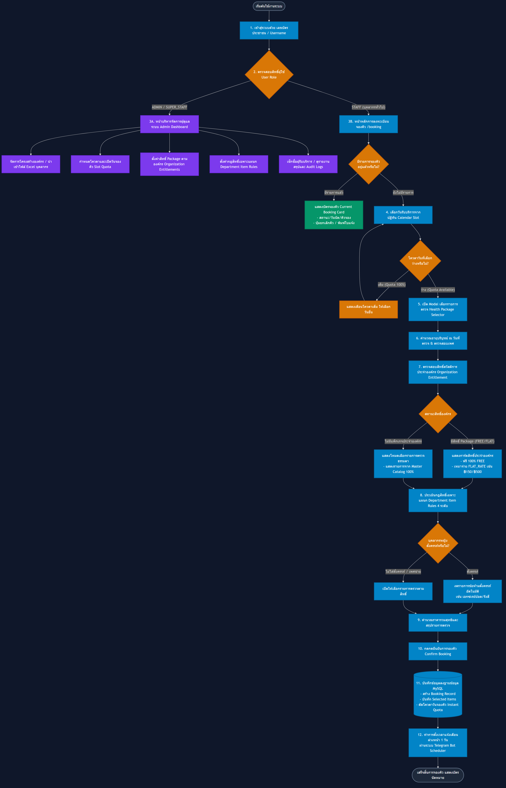
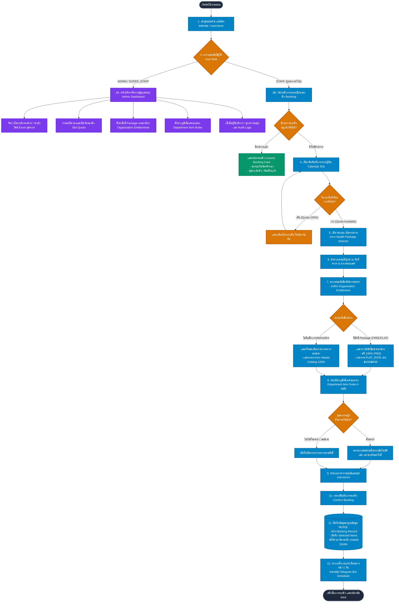
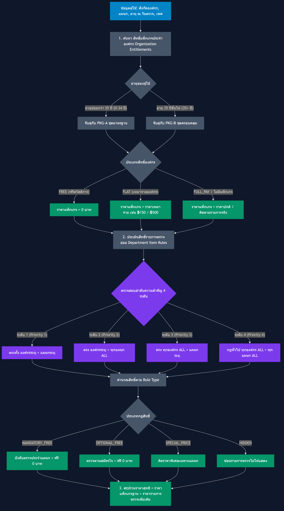
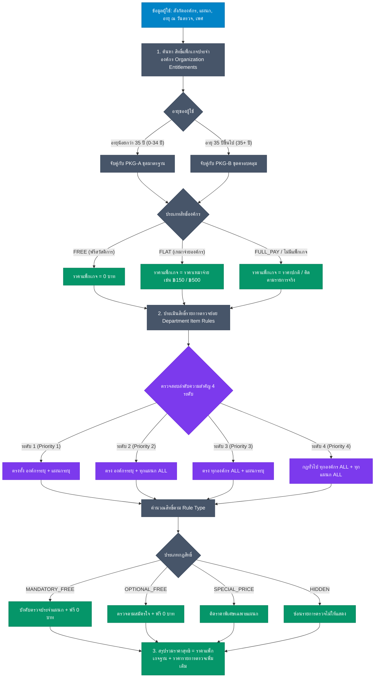

# 📐 แผนผังระบบและสถาปัตยกรรมกระบวนการทำงานเต็มระบบ (Full System Flowchart & Architecture)

> **ระบบจองวันและบริหารจัดการการตรวจสุขภาพประจำปี (Annual Health Checkup System)**  
> โรงพยาบาลท่าสองยาง และ หน่วยงานภาคีเครือข่ายสาธารณสุข

---

## 1. 📊 แผนผังกระบวนการทำงานภาพรวม (Overall System Flowchart)

> 🔍 **ตัวเลือกการดูแบบขยายใหญ่ (คมชัด ไม่แตก)**:
> - 📐 [เปิดดูภาพ Vector SVG (ขยายได้ไม่จำกัด เท่าไหร่ก็ไม่แตก)](images/flowchart_overall.svg)
> - 🖼️ [ดาวน์โหลดภาพความละเอียดสูง 4K PNG](images/flowchart_overall_4k.png)
> - 🌐 [เปิดหน้าต่าง Interactive Drag & Zoom (ลากเมาส์ / หมุนซูมเข้า-ออกได้)](http://localhost:5555/flowchart.html)

🔍 คลิกเพื่อดู Mermaid Code (Overall System Flowchart)

---

## 2. 🧮 แผนผังระบบคำนวณสิทธิ์และราคาไดนามิก (Dynamic Pricing & Entitlements Engine)

> 🔍 **ตัวเลือกการดูแบบขยายใหญ่ (คมชัด ไม่แตก)**:
> - 📐 [เปิดดูภาพ Vector SVG (ขยายได้ไม่จำกัด เท่าไหร่ก็ไม่แตก)](images/flowchart_pricing.svg)
> - 🖼️ [ดาวน์โหลดภาพความละเอียดสูง 4K PNG](images/flowchart_pricing_4k.png)
> - 🌐 [เปิดหน้าต่าง Interactive Drag & Zoom (ลากเมาส์ / หมุนซูมเข้า-ออกได้)](http://localhost:5555/flowchart.html)

🔍 คลิกเพื่อดู Mermaid Code (Dynamic Pricing & Entitlements Engine)

---

## 3. 📝 คำอธิบายการทำงานแต่ละโมดูลอย่างละเอียด (Detailed Technical Breakdown)

### 🔑 โมดูลที่ 1: ระบบยืนยันตัวตนและการกระจายสิทธิ์ตามบทบาท (Authentication & Authorization)
1. **การเข้าสู่ระบบ (Login Process)**:
   - ผู้ใช้เข้าสู่ระบบด้วย **เลขบัตรประชาชน (Citizen ID)** หรือ Username และ รหัสผ่าน
   - ระบบทำการดึงข้อมูลจากตาราง `users` และตรวจเช็กบทบาทผู้ใช้ (`role`):
     - `STAFF`: บุคลากรทั่วไปที่เข้ามารับบริการตรวจสุขภาพ
     - `SUPER_STAFF`: หัวหน้าหน่วยงาน/ผู้ดูแลแผนกที่สามารถดูรายงานย่อยได้
     - `ADMIN`: ผู้ดูแลระบบหลักที่มีสิทธิ์ตั้งค่าทั้งหมด
2. **การคำนวณอายุและเพศ (Age & Gender Detection)**:
   - ระบบคำนวณ **อายุบริบูรณ์ (Completed Age)** ณ วันที่เข้ารับการตรวจสุขภาพจริง (`checkupTargetDate`) โดยใช้สูตรเปรียบเทียบ ปี/เดือน/วัน เพื่อความแม่นยำสูง
   - ตรวจสอบเพศสภาพจากคำนำหน้าชื่อหรือฟิลด์เพศ เพื่อใช้กรองรายการตรวจเฉพาะเพศ (เช่น มะเร็งปากมดลูก ThinPrep, อัลตราซาวด์เต้านม Mammogram)

---

### 📅 โมดูลที่ 2: ระบบบริหารจัดการโควตาและเปิดวันจองคิว (Slot Quota Engine)
1. **โควตารายวัน (Daily Quotas)**:
   - ผู้ดูแลระบบกำหนดสล็อตวันรับบริการในตาราง `slots` พร้อมระบุจำนวนโควตารับบริการสูงสุด (`quota`)
2. **การตรวจสอบโควตาคงเหลือแบบ Real-time**:
   - เมื่อผู้ใช้เลือกวันที่ในปฏิทิน ระบบจะคำนวณ `remaining = quota - bookedCount`
   - หากโควตาเต็ม (`remaining <= 0`) ระบบจะปิดกั้นปุ่มกด และแสดงสถานะ **"โควตาเต็ม 100%"** เพื่อป้องกันการจองคิวซ้ำซ้อน (Overbooking)

---

### 💳 โมดูลที่ 3: ระบบคำนวณสิทธิ์แพ็กเกจประจำองค์กร (Organization Entitlements Engine)
ระบบรองรับสิทธิ์สวัสดิการของแต่ละสังกัดองค์กร (`organization_entitlements`) ในรูปแบบที่ยืดหยุ่น:
1. **สิทธิ์ตรวจฟรีสวัสดิการ 100% (FREE Mode)**:
   - เหมาะสำหรับบุคลากรประจำ (เช่น โรงพยาบาลท่าสองยาง) 
   - แบ่งเกณฑ์ตามอายุ: **อายุน้อยกว่า 35 ปี (PKG-A)** และ **อายุ 35 ปีขึ้นไป (PKG-B)**
2. **สิทธิ์เหมาจ่ายสวัสดิการองค์กร (FLAT RATE Mode)**:
   - เหมาะสำหรับองค์กรภายนอกที่มีงบประมาณเหมาจ่าย (เช่น สสอ.ท่าสองยาง)
   - กำหนดราคาเหมาจ่ายตามช่วงอายุ เช่น PKG-A = เหมาจ่าย ฿150 บาท, PKG-B = เหมาจ่าย ฿500 บาท
3. **โหมดไม่มีแพ็กเกจประจำองค์กร (Custom / Regular Mode)**:
   - หากองค์กรใดไม่ได้มีการตั้งค่าแพ็กเกจไว้ ระบบจะ **ไม่แสดงการ์ดแพ็กเกจแบบสุ่มสี่สุ่มห้า** แต่จะเปลี่ยนเป็นโหมด **"รายการตรวจสุขภาพธรรมดา"** โดยดึงรายการตรวจจาก Master Catalog มาให้เลือกเป็นรายบุคคลตามราคาปกติ

---

### 📍 โมดูลที่ 4: ระบบกฎสิทธิ์เฉพาะแผนก/หน่วยงาน (Department Item Rules Engine)
เพื่อแก้ปัญหาบุคลากรบางแผนกต้องได้รับตรวจแล็บเฉพาะทาง (เช่น โภชนาการต้องตรวจอุจจาระ Stool Exam หรือ พนักงานขับรถต้องตรวจสารเสพติด) ระบบใช้ **Matching Hierarchy 4 ลำดับความสำคัญ**:

1. **Priority 1 (เจาะจงสูงสุด)**: ตรงทั้ง `องค์กรระบุ` + `แผนกระบุ` (เช่น *โรงพยาบาลท่าสองยาง* + *งานชันสูตรสาธารณสุข*)
2. **Priority 2 (ระดับองค์กร)**: ตรง `องค์กรระบุ` + `ทุกแผนก (ALL)` (เช่น *โรงพยาบาลท่าสองยาง* + *ทั้งหมด*)
3. **Priority 3 (ระดับแผนกข้ามองค์กร)**: ตรง `ทุกองค์กร (ALL)` + `แผนกระบุ` (เช่น *ทั้งหมด* + *งานโภชนาการ*)
4. **Priority 4 (กฎส่วนกลาง)**: `ทุกองค์กร (ALL)` + `ทุกแผนก (ALL)`

**ประเภทของกฎ (Rule Types)**:
- `MANDATORY_FREE`: บังคับตรวจประจำแผนก + ฟรีสวัสดิการ (ระบบเลือกให้อัตโนมัติและไม่คิดเงิน)
- `OPTIONAL_FREE`: สิทธิ์ตรวจฟรีเพิ่มเติมตามสมัครใจ
- `SPECIAL_PRICE`: คิดราคาพิเศษเฉพาะแผนก/องค์กรนั้นๆ
- `HIDDEN`: ซ่อนรายการตรวจออกจากหน้าจอ

---

### 🤰 โมดูลที่ 5: ระบบคัดกรองความปลอดภัยสตรีมีครรภ์ (Pregnancy Screening Protection)
- สำหรับบุคลากรหญิง เมื่อติ๊กเลือก *"อยู่ระหว่างตั้งครรภ์ หรือสงสัยว่าตั้งครรภ์"*
- ระบบจะทำการ **งด/ยกเว้นรายการตรวจที่มีข้อห้ามสำหรับสตรีมีครรภ์อัตโนมัติ (เช่น เอกซเรย์ปอด Chest X-Ray / รังสีวินิจฉัย)** เพื่อความปลอดภัยสูงสุดของผู้รับบริการ

---

### 🔔 โมดูลที่ 6: ระบบแจ้งเตือนอัตโนมัติและการดำเนินงานหลังบ้าน (Background Scheduler & Admin Operations)
1. **การนำเข้าข้อมูลบุคลากรแบบกลุ่ม (Bulk Excel Import)**:
   - ผู้ดูแลระบบสามารถดาวน์โหลด Template และอัปโหลดไฟล์ Excel เพื่อนำเข้าสังกัดองค์กร แผนก และรายชื่อเจ้าหน้าที่พร้อมกันคราวละมากๆ
2. **ระบบแจ้งเตือนผ่าน Telegram (Automatic 1-Day Reminder)**:
   - มีระบบ Background Task (`AutoScheduler`) รันตรวจสอบคิวนัดหมายล่วงหน้า 1 วันโดยอัตโนมัติทุกๆ 1 ชั่วโมง 
   - ส่งข้อความแจ้งเตือนใบนัดและสถานที่รับบริการไปยัง Telegram Bot ของบุคลากร
3. **ระบบติดตามผู้เข้ารับบริการ (Daily Attendance & Audit Logging)**:
   - เจ้าหน้าที่จุดลงทะเบียนสามารถค้นหาชื่อ สแกน และกดบันทึกสถานะการเข้ารับบริการจริง (`ATTENDED`) 
   - บันทึกการเปลี่ยนแปลงสำคัญลงในตาราง `audit_logs` เพื่อความโปร่งใสและตรวจสอบย้อนหลังได้ 100%
